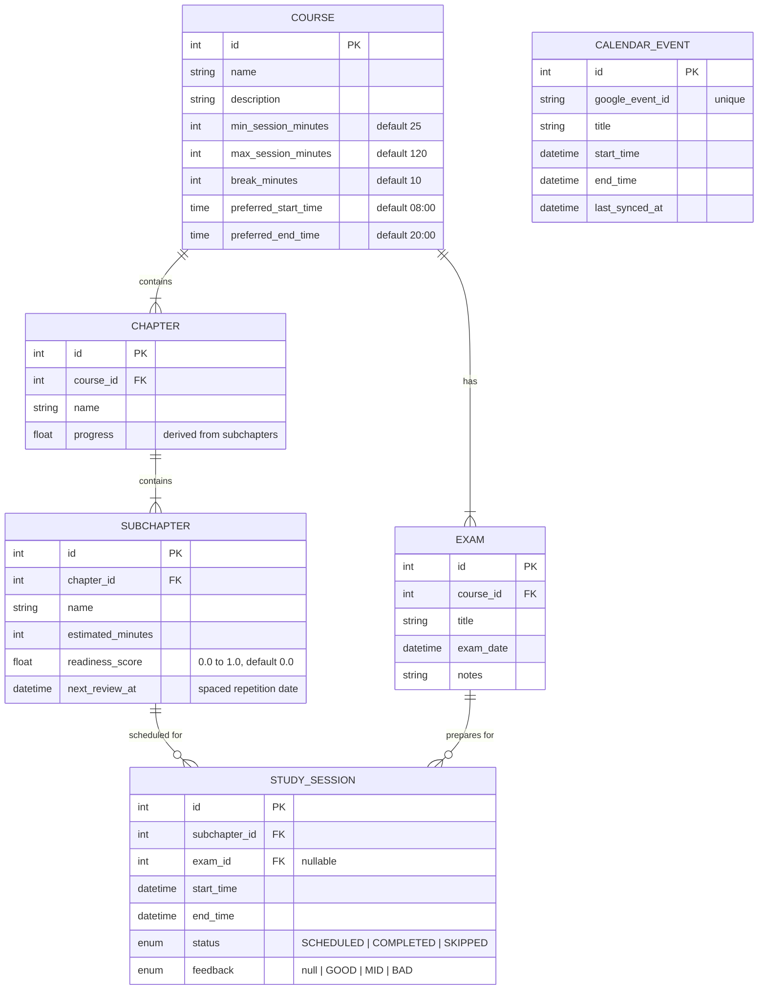

# SmartStudyPlanner

A single-user web application that helps you plan, schedule, and track study sessions across multiple exams using **spaced repetition**, **readiness scoring**, and **Google Calendar integration** to avoid scheduling conflicts.

---

## Tech Stack

| Layer      | Technology                              |
|------------|-----------------------------------------|
| Frontend   | Angular 19, TypeScript, TailwindCSS     |
| Backend    | Java 21, Spring Boot 3, Spring Data JPA |
| Database   | PostgreSQL 16                           |
| Build      | Gradle (backend), Angular CLI (frontend)|
| Dev        | Docker Compose (PostgreSQL)             |

---

## Project Structure

```
SmartStudyPlanner/
├── backend/                          # Spring Boot application
│   ├── src/main/java/com/smartstudy/
│   │   ├── config/                   # App & Google API config
│   │   ├── controller/               # REST controllers
│   │   ├── dto/                      # Request/Response DTOs
│   │   ├── entity/                   # JPA entities
│   │   ├── repository/               # Spring Data repositories
│   │   ├── service/                  # Business logic
│   │   │   ├── scheduler/            # Study session generation & spaced repetition
│   │   │   └── sync/                 # Google Calendar sync
│   │   └── SmartStudyApplication.java
│   ├── src/main/resources/
│   │   ├── application.yml
│   │   └── db/migration/             # Flyway migrations
│   └── build.gradle
├── frontend/                         # Angular application
│   ├── src/app/
│   │   ├── core/                     # Services, guards, interceptors
│   │   ├── shared/                   # Reusable components, pipes, directives
│   │   ├── features/
│   │   │   ├── dashboard/            # Main dashboard with charts & exam overview
│   │   │   ├── calendar/             # Calendar view (study blocks + Google events)
│   │   │   ├── exams/                # Exam CRUD & detail view
│   │   │   └── courses/              # Course, chapter, subchapter management
│   │   └── app.component.ts
│   ├── angular.json
│   └── package.json
├── docker-compose.yml                # PostgreSQL + pgAdmin
└── README.md
```

---

## Data Model



### Key Concepts

- **Readiness Score** (`0.0` - `1.0`): Reflects how well you know a subchapter. Driven by session feedback:
  - `GOOD` -> score increases, next review pushed further out (spaced repetition)
  - `MID` -> score stays roughly the same, next review at moderate interval
  - `BAD` -> score decreases, more sessions generated sooner
- **Chapter Progress**: Derived as the average readiness score of all its subchapters.
- **Spaced Repetition**: `next_review_at` is calculated using an SM-2-inspired algorithm based on the readiness score and feedback history.

---

## Scheduling Algorithm

```
Input:  exam, course constraints, subchapters with readiness scores, Google Calendar events
Output: list of StudySessions

1. Fetch all CALENDAR_EVENTs between NOW and exam.exam_date
2. Fetch existing STUDY_SESSIONs in the same range
3. Build a "busy slots" timeline from both sources
4. Collect subchapters needing review:
   - All subchapters where readiness_score < threshold (e.g., 0.8)
   - Sorted by: next_review_at ASC, then readiness_score ASC (weakest first)
5. For each available day between NOW and exam.exam_date:
   a. Find free windows by subtracting busy slots from [preferred_start, preferred_end]
   b. Split free windows into session-sized blocks respecting:
      - min_session_minutes <= block <= max_session_minutes
      - break_minutes gap between consecutive blocks
   c. Assign subchapters to blocks:
      - Prioritize subchapters whose next_review_at <= current day
      - Increase session density as exam approaches (urgency weight)
      - Low readiness subchapters get more frequent sessions
6. Return generated STUDY_SESSIONs (status = SCHEDULED)
```

After each completed session with feedback, the service:
1. Updates the subchapter's `readiness_score`
2. Recalculates `next_review_at` using spaced repetition intervals
3. Optionally regenerates future sessions for that subchapter

---

## Google Calendar Sync

- **OAuth2** with Google Calendar API (read-only scope)
- **Periodic sync**: Spring `@Scheduled` job every 15 minutes pulls events and upserts into `CALENDAR_EVENT` table
- **On-demand sync**: `POST /api/calendar/sync` triggers immediate sync
- Events are matched by `google_event_id` to handle updates and deletions
- Only events within a configurable lookahead window (e.g., 60 days) are synced

---

## API Endpoints

### Courses
| Method | Route                              | Description                   |
|--------|------------------------------------|-------------------------------|
| GET    | /api/courses                       | List all courses              |
| POST   | /api/courses                       | Create a course               |
| PUT    | /api/courses/{id}                  | Update course (incl. constraints) |
| DELETE | /api/courses/{id}                  | Delete course                 |

### Chapters & Subchapters
| Method | Route                              | Description                   |
|--------|------------------------------------|-------------------------------|
| GET    | /api/courses/{id}/chapters         | List chapters with progress   |
| POST   | /api/courses/{id}/chapters         | Create chapter                |
| GET    | /api/chapters/{id}/subchapters     | List subchapters with scores  |
| POST   | /api/chapters/{id}/subchapters     | Create subchapter             |
| PATCH  | /api/subchapters/{id}              | Update subchapter             |

### Exams
| Method | Route                              | Description                   |
|--------|------------------------------------|-------------------------------|
| GET    | /api/exams                         | List all exams with meta info |
| POST   | /api/exams                         | Create exam                   |
| PUT    | /api/exams/{id}                    | Update exam                   |
| DELETE | /api/exams/{id}                    | Delete exam                   |

### Study Sessions
| Method | Route                              | Description                   |
|--------|------------------------------------|-------------------------------|
| GET    | /api/sessions                      | List sessions (filterable by date range, exam, status) |
| POST   | /api/exams/{id}/sessions/generate  | Generate study sessions for exam |
| PATCH  | /api/sessions/{id}                 | Update session (reschedule, feedback) |
| POST   | /api/sessions/{id}/complete        | Mark complete with feedback -> triggers readiness recalc |

### Calendar
| Method | Route                              | Description                   |
|--------|------------------------------------|-------------------------------|
| GET    | /api/calendar/events               | List cached Google Calendar events |
| POST   | /api/calendar/sync                 | Trigger immediate sync        |

### Dashboard
| Method | Route                              | Description                   |
|--------|------------------------------------|-------------------------------|
| GET    | /api/dashboard                     | Aggregated stats: upcoming exams, today's sessions, weekly hours, progress per course |

---

## UI Layout

```
+------------------------------------------------------------------+
|  HEADER: SmartStudyPlanner                        [Sync] [Today]  |
+------------------------------------------------------------------+
|           |                                                       |
|  SIDEBAR  |              CALENDAR VIEW                            |
|           |  (week/month/day toggle)                              |
|  Exams    |                                                       |
|  --------+|  +--------+ +--------+ +--------+                    |
|  Exam 1   |  | Google | | Study  | | Study  |                    |
|  15d left |  | Event  | | Block  | | Block  |                    |
|  ██░░ 40% |  | (grey) | | (blue) | | (green)|                    |
|  --------+|  +--------+ +--------+ +--------+                    |
|  Exam 2   |                                                       |
|  3d left  |                                                       |
|  ████ 80% |                                                       |
|           |                                                       |
+-----------+-------------------------------------------------------+
|  DETAIL PANEL (when exam selected):                               |
|  Chapter 1  ██████░░░░ 60%                                       |
|    └ Sub 1.1  ████████░░ 80%  (next review: tomorrow)            |
|    └ Sub 1.2  ███░░░░░░░ 30%  (next review: today)              |
|  Chapter 2  ██░░░░░░░░ 20%                                       |
|    └ Sub 2.1  ░░░░░░░░░░  0%  (not started)                     |
+------------------------------------------------------------------+
```

- **Calendar**: Color-coded blocks — Google events (grey), study sessions by course color, completed (green), missed (red)
- **Sidebar**: All exams with days remaining + progress bar
- **Detail Panel**: Expands on click — shows chapter/subchapter tree with readiness scores and next review dates
- **Dashboard Charts**: Study hours per week (bar chart), readiness trend per course (line chart), session feedback distribution (pie/donut chart)

---

## Getting Started

```bash
# Start PostgreSQL
docker-compose up -d

# Backend
cd backend
./gradlew bootRun

# Frontend
cd frontend
npm install
ng serve
```

App runs at `http://localhost:4200`, API at `http://localhost:8080`.
